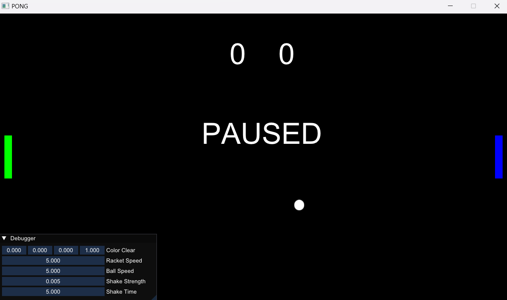
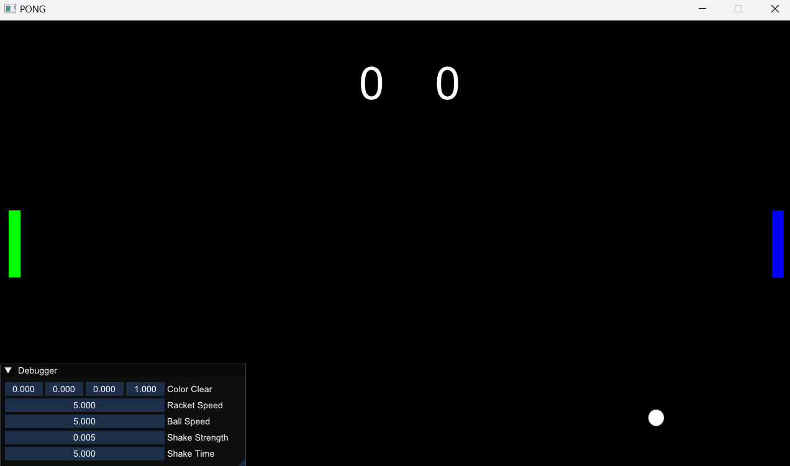
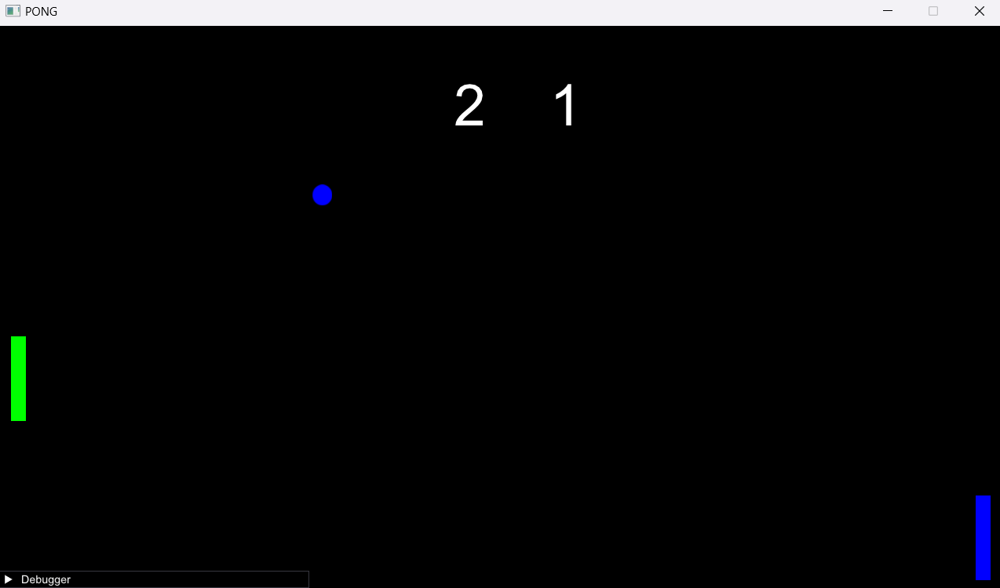

# Pong GL

This is a remake of the nostalgic game pong. made with OpenGL
## Libraries

- GLFW
- GLAD
- ImGUI (UI library)
- glm   (Linear algebra calculation library)
- stb_image (Image loading library)
- irrKlang (Audio library)


## Build guid

right now it has some trouble with MINGW compiler. So I reccomend using the MSVC compiler.

so open up you directory and write this in cmd.(make sure you have cmake installed)

```bash
  git clone https://github.com/alithegreat74/Pong_GL.git
  cd Pong_GL
  mkdir Build
  cd Build
  cmake ..
```

## Currently implemented features

- Input binding
- Game object movement
- User interface
- Ball movement
- Collsion system
- Audio Player
- Screen Shake
- Score board


## Screenshots






